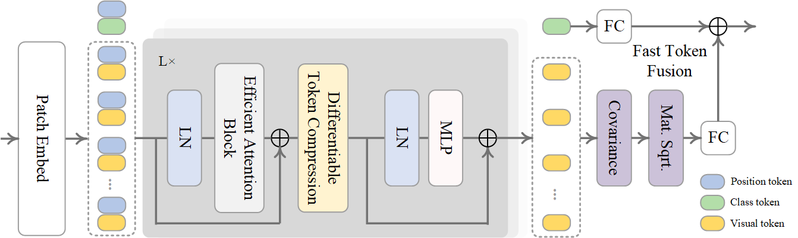

# SDT<sup>2</sup>Net
This a official Pytorch implementation of our paper "[Remote Sensing Scene Classification via Second-order Differentiable Token Transformer Network](https://ieeexplore.ieee.org/document/10542965)"


## What SDT<sup>2</sup>Net Does

The vision transformer has been widely applied in remote sensing image scene classification due to its excellent ability to capture global features. However, remote sensing scene images involve challenges such as scene complexity and small inter-class differences. Directly utilizing the global tokens of transformer for feature learning may increase computational
complexity. Therefore, constructing a distinguishable transformer network which adaptively selects tokens can effectively improve the classification performance of remote sensing scene images while considering computational complexity. Based on this, a second-order differentiable token transformer network (SDT<sup>2</sup>Net) is proposed for considering the efficacy of distinguishable statistical features and non-redundant learnable tokens of remote sensing scene images. A novel transformer block, including an efficient attention block (EAB) and differentiable token compression (DTC) mechanism, is inserted into SDT<sup>2</sup>Net for acquiring selectable token features of each scene image guided by sparse shift local features and token compression rate learning style. Furthermore, a fast token fusion (FTF) module is developed for acquiring more distinguishable token feature representations. This module utilizes the fast global covariance pooling algorithm to acquire high-order visual tokens and validates the effectiveness of classification tokens and high-order visual tokens for scene classification. Compared with other recent methods, SDT<sup>2</sup>Net achieves the most advanced performance with comparable FLOPs (Floating Point OperationsPer Second).

## Requirements
```
- python >= 3.8
- pytorch >= 1.12.1  
- torchvision        
- timm == 0.4.5      
```


## Data Preparation
- The NWPU-RESISC45 dataset should be prepared as follows:
```
NWPU-RESISC45
├── train
│   ├── folder 1 (class 1)
│   ├── folder 2 (class 2)
│   ├── ...
├── val
│   ├── folder 1 (class 1)
│   ├── folder 2 (class 2)
│   ├── ...

```

## Pre-Trained Models

Users can load the pretrained model we trained in this article to make fine-tuning. Of course, our proposed SDT<sup>2</sup>Net can be operated utilizing the pre-trained models of DeiT. The pretrained model is located under the path `./model/pretrain/`.


## Training

To find the optimal compression rate by proposed SDT<sup>2</sup>Net, run the following code and search a `4.5G` compression rate schedule for `DeiT-S`:
```
python main.py \
--arch-lr 0.01 --arch-min-lr 0.01 \
--epoch 100 --batch-size 64 \
--data-path $path_to_imagenet$ \
--output_dir $path_to_save_log$ \
--model vit_deit_SDT2Net_small_patch16_224 \
--target_flops 4.5
```

- supported `$target_flops$`: a floating point number

## Citation
If you use SDT<sup>2</sup>Net or this repository in your work, please cite:
```
@ARTICLE{10542965,
  author={Ni, Kang and Wu, Qianqian and Li, Sichan and Zheng, Zhizhong and Wang, Peng},
  journal={IEEE Transactions on Geoscience and Remote Sensing}, 
  title={Remote Sensing Scene Classification via Second-Order Differentiable Token Transformer Network}, 
  year={2024},
  volume={62},
  number={},
  pages={1-15},
  doi={10.1109/TGRS.2024.3407879}}
```

## Acknowledge
This codebase borrow some code from [DeiT](https://github.com/facebookresearch/deit) and [DiffRate](https://github.com/OpenGVLab/DiffRate). Thanks for their wonderful work.
